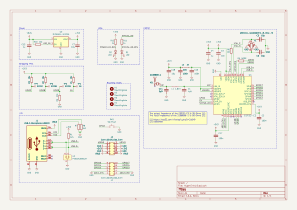

# HyperLink

A PCB for gathering data sent out by CommonSense boards over bluetooth and
retransmitting over wifi.

After cloning, the libraries can be downloaded using

```bash
$ git submodule update --init
```

## PCB


## Schematic


